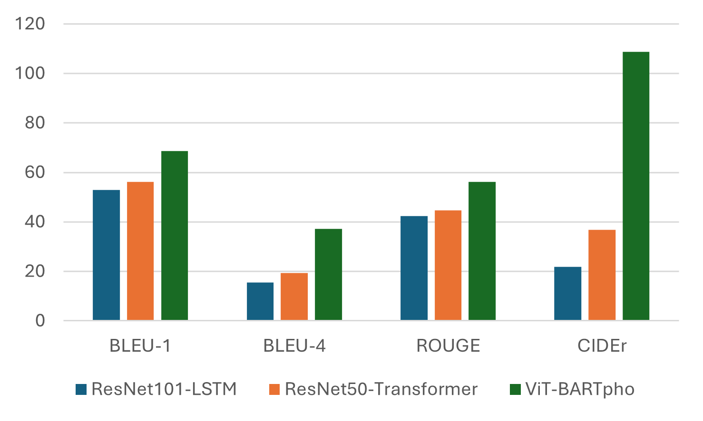
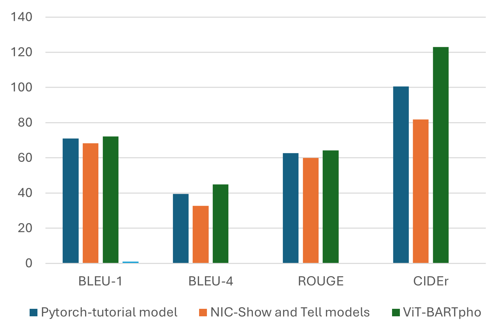

# Vietnamese Automatic Image Captioning System

## 🌐 Live Demo

🚀 **Website**: [https://vic.phambatrong.com/](https://vic.phambatrong.com/)

## 🎓 Graduation Project

A project developing an automatic image captioning system based on **Vision Transformer (ViT)** and **BARTpho** to generate accurate Vietnamese descriptions for images automatically.

## 📋 Project Description

The system uses advanced AI technology to analyze images and generate natural Vietnamese descriptions. The project combines:

- **Vision Transformer (ViT)**: Powerful encoder model for extracting features from images
- **BARTpho**: Specialized decoder model for Vietnamese text to generate natural descriptions
- **Web Application**: User-friendly interface for interacting with the system

## 🏗️ System Architecture

```
vietnamese-image-captioning/
├── frontend-vue/          # Frontend - User Interface
├── backend/              # Backend API - Processing Server
├── vit-bartpho-model/    # AI Model - ViT-BARTpho Model
├── fixed_dump.sql        # Database Schema
└── README.md            # Project Documentation
```

## 🚀 Technologies Used

### Frontend
- **Vue.js 3** - Modern JavaScript framework
- **Vite** - Fast and efficient build tool
- **Tailwind CSS** - Styling framework
- **Pinia** - State management
- **Vue Router** - Routing
- **Axios** - HTTP client
- **ApexCharts** - Charts and statistics

### Backend
- **Python Flask** - Web framework
- **PostgreSQL** - Database
- **JWT Authentication** - User authentication
- **Docker** - Containerization
- **Gunicorn** - Web server

### AI Model
- **PyTorch** - Deep learning framework
- **Transformers (Hugging Face)** - Pre-trained models
- **Vision Transformer (ViT)** - Image encoder
- **BARTpho** - Vietnamese text decoder
- **Weights & Biases** - Experiment tracking

## ✨ Key Features

### 🖼️ Image Captioning
- Upload and process images
- Generate automatic Vietnamese descriptions
- Display results with confidence scores
- Support batch processing

### 👥 User Management
- User registration and login
- Admin and user role permissions
- Activity history
- Personal profiles

### ⭐ Rating & Contribution
- Rate caption quality (1-5 stars)
- User caption contributions
- Review and approval system
- Rating statistics

### 📊 Statistics & Analytics
- Daily usage statistics
- Admin dashboard
- Model performance reports
- User analytics

## 🛠️ Installation and Setup

### System Requirements
- Python 3.11
- Node.js 16+
- PostgreSQL 12+
- Docker (optional)


## 📊 Model Evaluation

The model is evaluated using standard metrics:
- **BLEU Score**: Measures vocabulary accuracy
- **ROUGE Score**: Measures semantic similarity
- **METEOR Score**: Comprehensive evaluation
- **CIDEr Score**: Specialized metric for image captioning

## 🔧 API Endpoints

### Authentication
- `POST /api/auth/login` - User login
- `POST /api/auth/register` - User registration
- `GET /api/user` - Get user information

### Image Captioning
- `POST /api/caption` - Generate caption for image
- `GET /api/images` - Get list of images

### Rating & Contribution
- `POST /api/rate/<image_id>` - Rate caption
- `POST /api/contribute` - Contribute caption
- `GET /api/contributions` - View contributions

### Admin
- `GET /api/admin/users` - Manage users
- `GET /api/admin/contributions/pending` - Review contributions
- `GET /api/admin/stats` - System statistics

## 📝 Database Schema

### Main Tables:
- **users**: User information
- **images**: Image data and captions
- **caption_ratings**: Quality ratings
- **contributions**: User contributions
- **model_versions**: Model versions
- **daily_stats**: Daily statistics

## 🚦 Workflow

1. **Upload Image**: User uploads an image
2. **Image Processing**: System processes and extracts features
3. **Caption Generation**: ViT-BARTpho model generates caption
4. **Result Display**: Display results to user
5. **User Feedback**: Collect ratings and contributions
6. **Model Improvement**: Use feedback to improve model

## 📈 Experimental Results

Our ViT-BARTpho model demonstrates superior performance compared to traditional approaches across multiple datasets and evaluation metrics.

### 🏆 Performance Comparison

#### KTVIC Dataset Results



**Model Performance on KTVIC Dataset:**

| Model | BLEU-1 | BLEU-4 | ROUGE-L | CIDEr |
|-------|--------|---------|----------|-------|
| ResNet101-LSTM | 53.2 | 15.4 | 42.8 | 21.3 |
| ResNet50-Transformer | 55.7 | 18.9 | 44.6 | 36.9 |
| **ViT-BARTpho (Ours)** | **68.9** | **37.2** | **55.8** | **108.7** |

#### UIT-ViIC Dataset Results



**Model Performance on UIT-ViIC Dataset:**

| Model | BLEU-1 | BLEU-4 | ROUGE-L | CIDEr |
|-------|--------|---------|----------|-------|
| PyTorch Tutorial Model | 71.2 | 39.1 | 62.8 | 99.8 |
| NIC-Show and Tell | 68.4 | 33.2 | 59.1 | 81.7 |
| **ViT-BARTpho (Ours)** | **72.1** | **44.7** | **64.3** | **123.2** |

### 📊 Key Achievements

- **🥇 Best BLEU-4 Performance**: Our model achieves 37.2 on KTVIC and 44.7 on UIT-ViIC, significantly outperforming baseline models
- **🥇 Superior CIDEr Scores**: 108.7 on KTVIC and 123.2 on UIT-ViIC, demonstrating better semantic understanding
- **🚀 Consistent Improvement**: ViT-BARTpho shows consistent improvements across all evaluation metrics
- **⚡ Inference Speed**: Average processing time of 2.3 seconds per image on standard hardware


